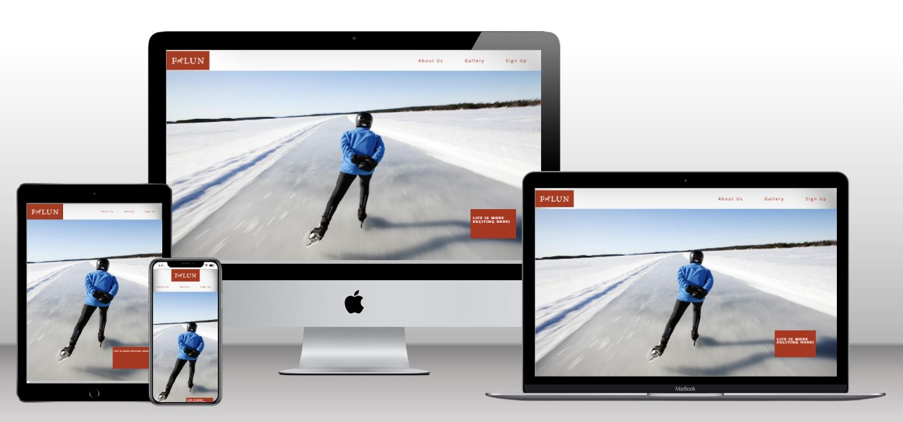
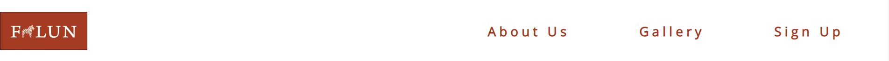
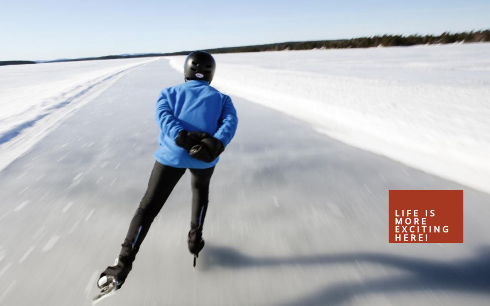
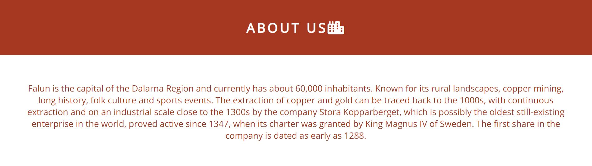
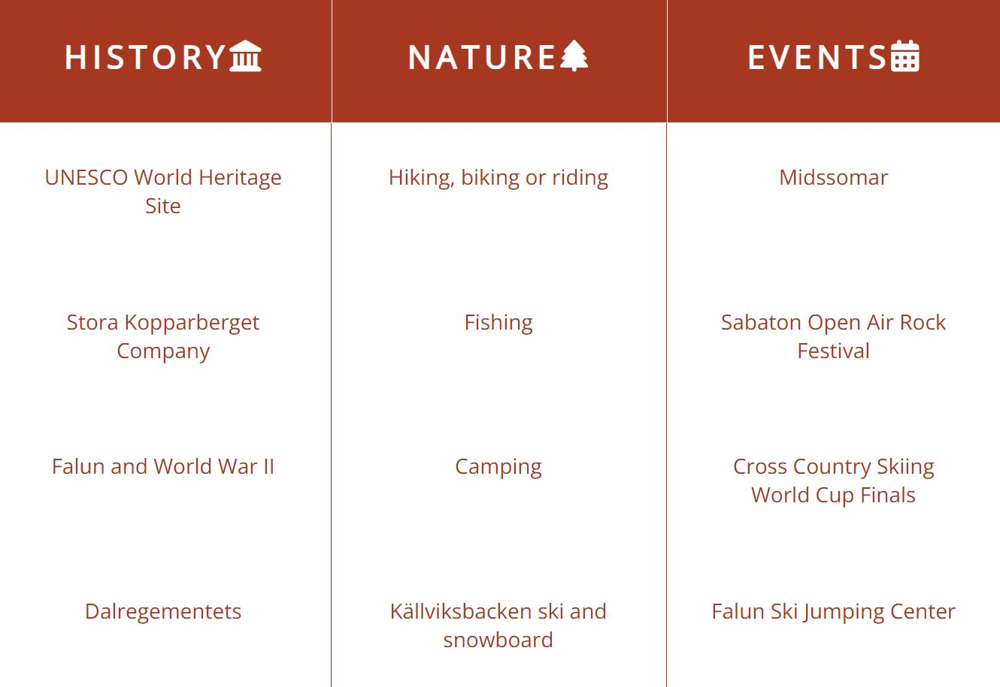
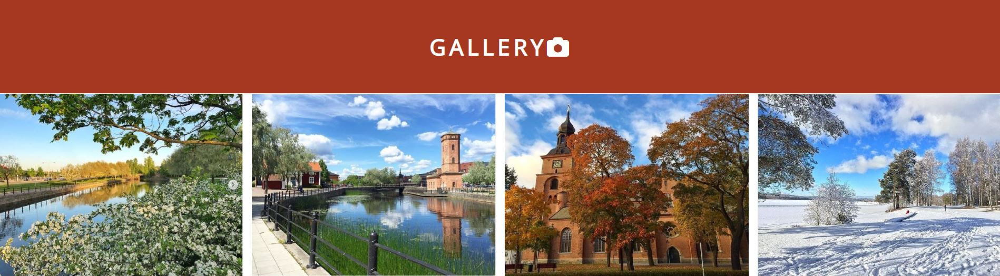
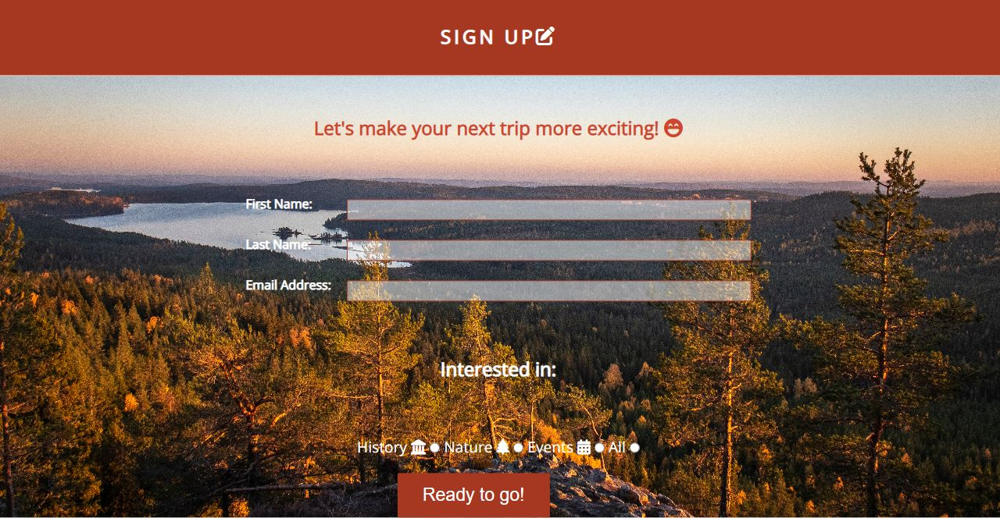
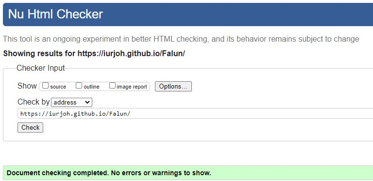
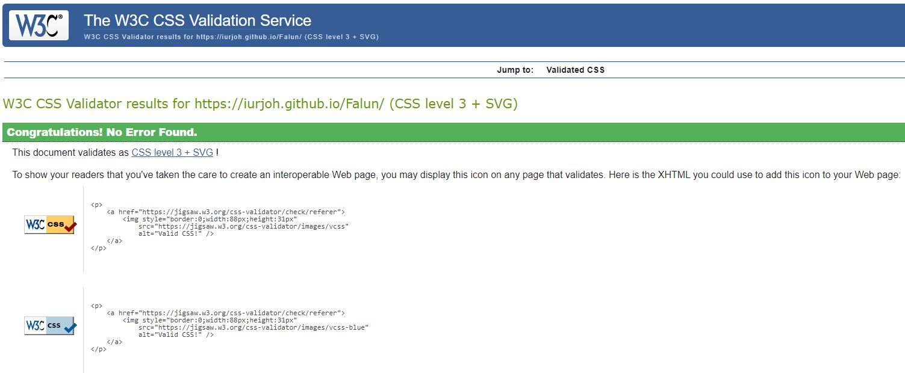

[View the live site here.](https://iurjoh.github.io/Falun/)

# Falun: Life is more exciting here!
"Falun: Life is more exciting here!" is a website that intends to publicize and promote tourism in the city of Falun, Sweden for all those who enjoy an exciting life, be it full of historic sites, beautiful natural landscapes full of wildlife or even attending cultural and sporting events.

We invite all tourists to get to know our wonderful city, showing on this website adapted for mobiles, tablets and desktops a panorama that we can offer throughout the 4 seasons of the year. Let's make your next trip more exciting!

# Features
## Existing Features
- ### Navigation Bar

    Show all section of the website in one scrollable. Each link from Logo, About Us, Gallery and Sign Up redirects the user directly to the desired section improving interaction and making navigation easier and more comfortable. Made in a responsive way, it adapts to different sizes of screens, from the smallest to the largest, always leaving a clean look and easy access for the user.

- ### The Landing Page Image
    
    This section features a photo to attract the user's attention and also show that Falun City is an amazing and very exciting place. In the lower left corner, a small passage conveys the message verbally in a simple and clear way, using the characteristic colors of the city in contrast to a white background with snow representing the city's winter season.

- ### About Us - Summary

    - A short overview of Falun' is presented to highlight the city's qualities and all it has to offer. It talks about the location, geographic data and importance of the city in the political-regional context as capital of the Dalarna Region, about the historical background, how and when the city emerged and some curious facts to grab the attention of users.

- ### About Us - Info Section

   - this section is divided in three subsections: History, Nature and Events. Within each one of them, 8 characteristic items present in the city of Falun are described, such as the most important historical points, the best outdoor activities to practice in the city and its surroundings, as well as the best sporting and cultural events that attract hundreds thousands of tourists annually.**

- ### The Gallery

    A display with eye-catching images of each of the 4 seasons of the year in the city of Falun is presented to the user in an immersive and responsive way that adapts in size and layout depending on which screen size the user is currently using. The images are real places in the city, within its urban space, making it clear to the visitor what he can expect from the city at each time of year.

- ### The Sing Up

    After being introduced to the wonders of getting to know the city of Falun and all of its amazing attractions, this section presents the user with the opportunity to sign up for more news/schedule their visit. With the mandatory fields, it is possible to collect the data of First Name, Last Name and Email, which can then be used to contact the user directly and capture him as a potential tourist to the city. . Choosing among the 4 entertainment options presented previously in the subsections of the About Us section, the user can make it clear what their specific interest is or if they have a general desire to know the city through the three points of view presented. Then a subscribe button is highlighted on the screen with a catchy phrase that evokes the user's desire to become a tourist and ultimately make their next trip more exciting.

- ###  The Footer

    In this space the user has at his disposal 5 links that direct him directly to official pages of Falun city. Facebook, Instagram, YouTube, Podcast and LinkedIn are presented as clickable icons that further deepen the user experience, allowing them to be even more interested, connected and exposed to new visual, audible and well-described arguments. The section presents a clean and easy-to-access design with spacingly variable and adjustable to different screen sizes.

- ###  Features Left to Implement

    At a later time, features can be added, such as:

    - A "sandwich icon" menu for presentation on smaller screens that would make the website design even more beautiful and accessible to the user;
    - Smooth swiping after clicking on a link that redirects directly to a section of the page;
    - An animation on the landing page image that presents a zoom effect, attracting even more the user's attention and making the experience even more immersive;
    - Clickable links in the subsections of About Us, taking the user to official pages of applications, shows, events, location of certain places through Google Maps, etc.;
    - An even larger gallery section, these 4 photos being clickable covers that redirect the user to a specific section of photos of the station chosen previously;
    - Improvement in the form system, being able to generate an automatic sending email so that the user receives a notification that he will now frequently receive more information and offers to reinforce his desire to come visit the city of Falun.

# Testing
- HTML

    Tests were carried out at various times. In the last few days, other tests were carried out to make the site in the best possible condition. No errors were presented by the [W3C validator](https://validator.w3.org/nu/?doc=https%3A%2F%2Fiurjoh.github.io%2FFalun%2F) and only one warning appeared, which was soon corrected. At the end, No errors were returned.

    

- CSS

    Likewise, several tests were done on the CSS code through the official [(Jigsaw) validator](https://jigsaw.w3.org/css-validator/validator?uri=https%3A%2F%2Fiurjoh.github.io%2FFalun%2F&profile=css3svg&usermedium=all&warning=1&vextwarning=&lang=en) and no errors were found.

    

## Unfixed Bugs
- The Ready to go button! disappears when hovering. Unfortunately, it can only be noticed very close to the delivery deadline. This should be fixed in a future code update.
- Falun logo was not loading in the live site version, but it was resolved with a change to the HTML code redirecting the image to be loaded directly from the main directory.
- The form's background image also had the same problem. It was fixed with the same solution as Falun logo.
- On devices with a screen resolution lower than 321x850px, the website presentation shows a white margin on the right. However, nothing was done because few users will use the site under these conditions.

# Languages Used
- [HTML5](https://en.wikipedia.org/wiki/HTML5)
- [CSS3](https://en.wikipedia.org/wiki/CSS) 

# Deployment
The site deployment was deploy through the GitHub repository. The steps are as follows:
- In the GitHub repository, click on Settings tab;
- Navigate to the menu on the left side and select Pages;
- Set the source in the Build and deployment item as "Deploy from a branch". Then, in the Branch item, the Main option was chosen, /(root) folder and finishing the settings with the Save button.

The link to the deployed website is: https://iurjoh.github.io/Falun/

# Credits
Here will be the sites that helped me find everything I needed to develop my work, including research and material sources.

## Content

Sites such as:
- [Stack Overflow](https://stackoverflow.co/) were used at various times to clear up recurring doubts,
- [Google Fonts](https://fonts.google.com/) to insert new fonts;
- [Font Awesome](https://fontawesome.com/) to add icons to HTML;
- [CSS Tricks](https://css-tricks.com/) to answer CSS questions;
- [Code Institute](https://learn.codeinstitute.net/) to review material of study explanatory videos and guides on how to set up a complete website;
- [GitHub](https://github.com/) to better understand other projects;
- [Google](https://www.google.com) for more information on subjects related to the that I had to study during the creation of the site;
- [W3C](https://www.w3.org/) to read the tutorials and understand basic rules of HTML and CSS;
- [Wikipedia](https://www.wikipedia.org/) to search more information about specific features of the city of Falun;
- [Falun official site](https://www.falun.se/) to get an idea of ​​the layout, palette of colors used, press/educational materials;
- [Youtube](https://www.youtube.com/) tutorials to learn using  in a practical way some of the methods necessary to implement the desired functions for the site;
- [Slack](https://slack.com/) communities to ask questions and access answers to questions that I found in the development of the site.

## Media

- [Falun official site](https://www.falun.se/) where I found photos, icons and logos for press use;
- [Techsini](https://techsini.com/multi-mockup/index.php) Multi Device Website Mockup Generator was used to generate the image used in this README.md in the opening section "Falun: Life is more exciting here!"
- Other images used on the site as in the Gallery section are from my personal archive.

## Acknowledgements
- My mentor for continuous helpful feedback.